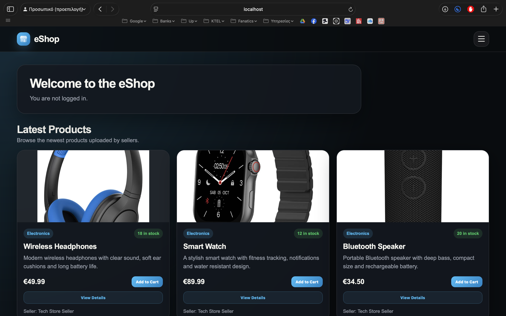
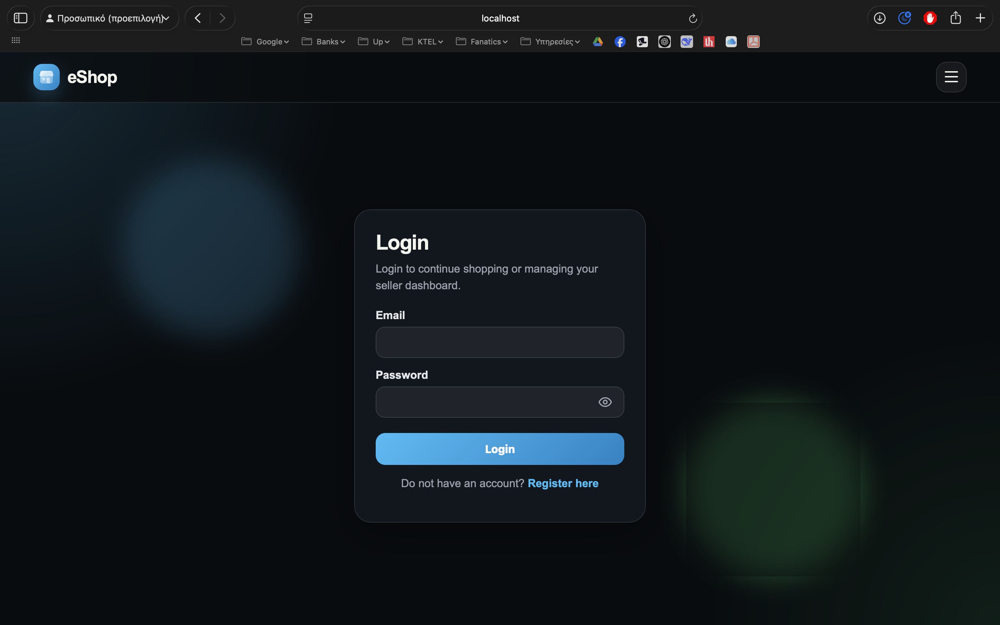
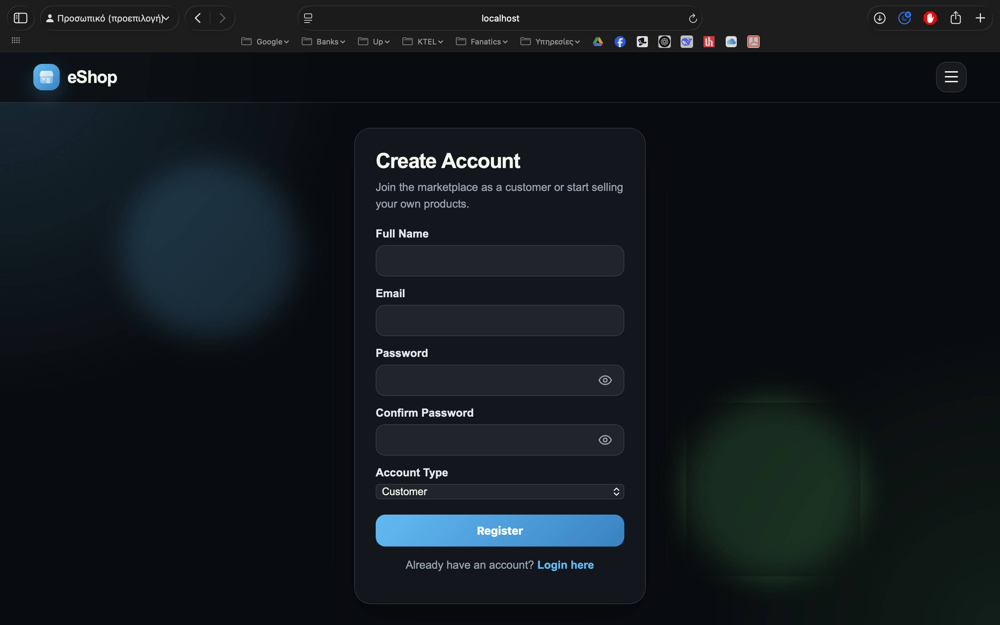
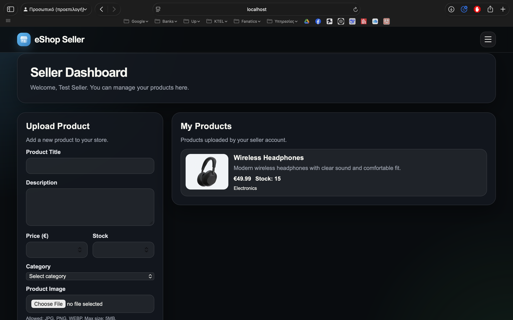
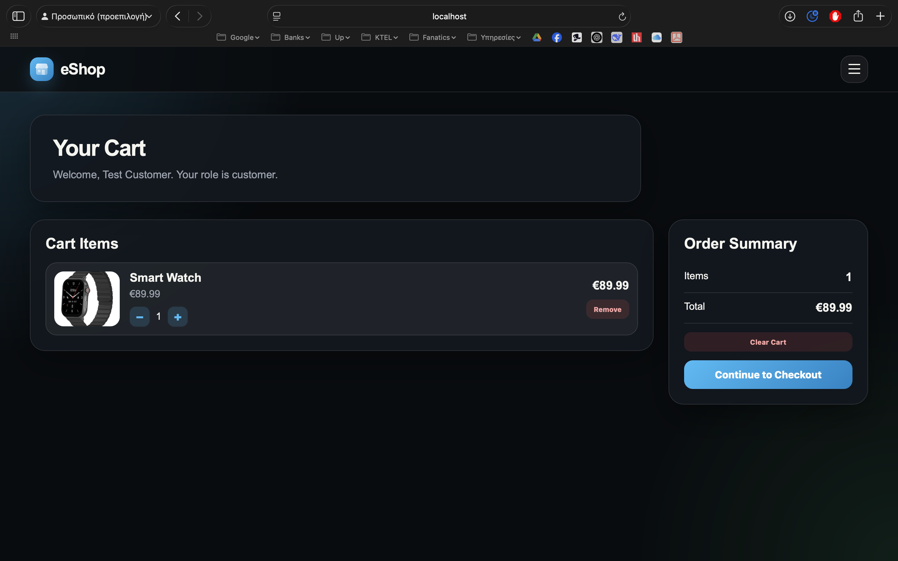
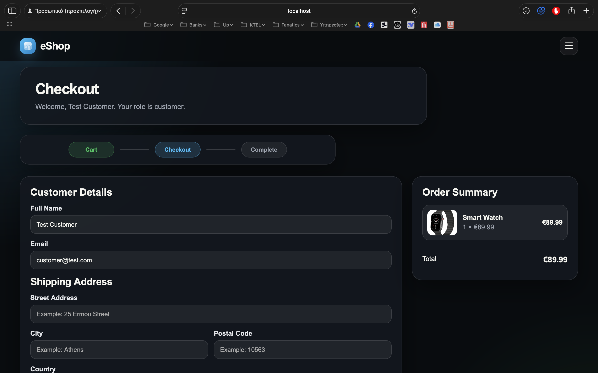
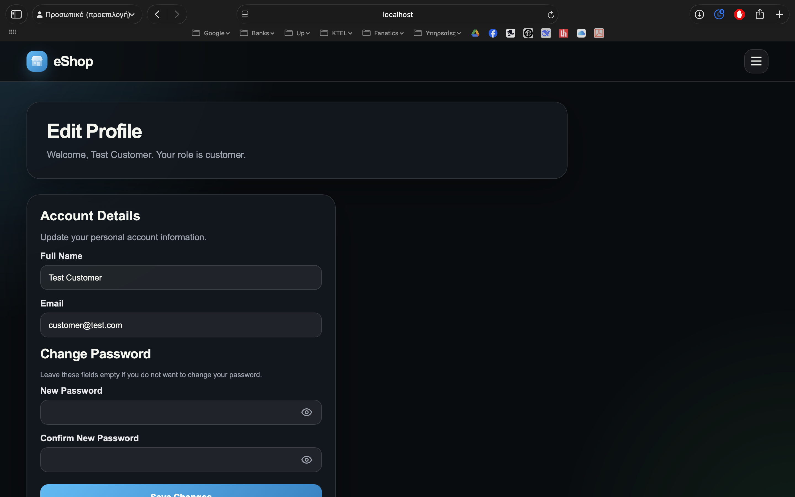

# eShop with PHP and JavaScript

A modern e-commerce web application built with PHP, JavaScript, MySQL, HTML and CSS.  
The platform supports customer and seller accounts, product uploads, product images, a client-side shopping cart, checkout, order storage and email confirmation.

The project was developed as part of an internship task focused on building a complete eShop system using core web technologies and a structured backend architecture.

---

## Project Overview

This project simulates a small online marketplace where sellers can upload products and customers can browse, add products to their cart and complete orders.

The system includes:

- Customer and seller registration
- Login and logout system
- Password hashing
- Session-based authentication
- Seller dashboard
- Product upload with image support
- Product listing on the homepage
- Shopping cart using JavaScript and `localStorage`
- Checkout flow connected to PHP sessions
- Order storage in MySQL
- Order items storage in MySQL
- Stock reduction after completed orders
- Email confirmation using SMTP
- Profile editing for logged-in users
- Modern responsive UI

---

## Technologies Used

The project uses the following technologies:

- PHP
- JavaScript
- MySQL
- phpMyAdmin
- HTML5
- CSS3
- XAMPP
- Composer
- PHPMailer
- Brevo SMTP
- SweetAlert2

---
## Installation

### 1. Clone the Repository

```bash
git clone https://github.com/LampisGian/eShop-with-PHP-and-JavaScript.git
```

Move the project inside the XAMPP `htdocs` folder:

```text
/Applications/XAMPP/xamppfiles/htdocs/
```

---

### 2. Start XAMPP

Start the following services:

- Apache
- MySQL

Then open phpMyAdmin:

```text
http://localhost/phpmyadmin
```

---

### 3. Create the Database

Create a new database in phpMyAdmin.

Example database name:

```text
eshop_db
```

Then import the provided SQL file:
```text
eshop_db.sql
```
This file contains the full database structure and ready-made demo data, including:

* User accounts
* Customer accounts
* Seller accounts
* Product categories
* Demo products
* Product image paths

After importing eshop_db.sql, the application will already have test accounts and products available, so the platform can be tested immediately without manually creating users or products.


---

### 4. Install Composer Dependencies

Open the terminal inside the `Source_Code` folder:

```bash
cd /Applications/XAMPP/xamppfiles/htdocs/eShop-with-PHP-and-JavaScript/Source_Code
composer install
```

If dependencies are already installed, you can refresh the autoload files with:

```bash
composer dump-autoload
```

---

### 5. Configure SMTP Email Settings

The project uses PHPMailer with Brevo SMTP to send order confirmation emails after a successful checkout.

First, create a Brevo account and generate an SMTP key from the Brevo dashboard:

```text
Brevo Dashboard
SMTP & API
SMTP
Generate a new SMTP key
```

Then create the following file inside the project:

`Source_Code/config/mail.php`

Add the SMTP configuration:

```php
<?php

return [
    'host' => 'smtp-relay.brevo.com',
    'port' => 587,
    'username' => 'YOUR_BREVO_SMTP_LOGIN',
    'password' => 'YOUR_BREVO_SMTP_KEY',
    'from_email' => 'YOUR_VERIFIED_SENDER_EMAIL',
    'from_name' => 'eShop Project'
];
```

The username value must be the SMTP login provided by Brevo.
The password value must be the SMTP key, not the normal Brevo account password.
The from_email value must be a verified sender email from Brevo.

This file contains sensitive credentials, so it must not be uploaded to GitHub.
Make sure it is included in `.gitignore`:

```text
http://localhost/eShop-with-PHP-and-JavaScript/Source_Code/views/home.html
```
---

### 6. Open the Application

Open the homepage:

```text
http://localhost/eShop-with-PHP-and-JavaScript/Source_Code/views/home.html
```

---

---

## Screenshots

The following screenshots show the main pages and features of the platform.

### Homepage

The homepage displays the available products, product images, stock information and product details.



### Login Page

The login page allows customers and sellers to access their accounts.



### Register Page

The register page allows new users to create either a customer or seller account.



### Seller Dashboard

The seller dashboard allows sellers to upload products, select categories and manage uploaded product images.



### Shopping Cart

The cart page displays selected products, quantities, item totals and the final cart total.



### Checkout Page

The checkout page collects customer details, shipping information and shows the final order summary.



### Edit Profile Page

The profile page allows logged-in users to update their account details.



